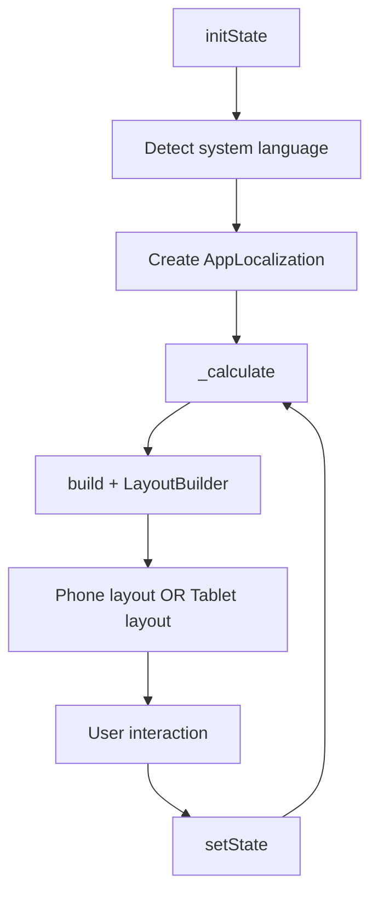

<div dir="rtl" style="width:min(1180px,100%);margin:0 auto;padding:0 16px;box-sizing:border-box;line-height:1.85;">

# دليل محدث لشاشة `calculator_screen.dart`

هذا المستند محدث ليتوافق مع آخر تعديل فعلي في `lib/screens/calculator_screen.dart`، خصوصا:

- التخطيط التكيفي بين الهاتف والتابلت.
- منع التمرير في التابلت عبر توزيع عمودين.
- حوارات بعرض مناسب للتابلت.
- إصلاحات `Expanded` داخل بيئة scrollable.
- إصلاح التفاف وحدة الوزن (مثل `kg`) على سطرين.

---

## ملخص تنفيذي سريع

| المحور | الوضع الحالي |
|---|---|
| نوع الشاشة | `StatefulWidget` |
| اتجاه اللغة | تلقائي عبر `Directionality` (`RTL/LTR`) |
| نقطة التحول Tablet | `constraints.maxWidth >= 600` |
| الهاتف | عمود واحد + `SingleChildScrollView` |
| التابلت | عمودان بلا تمرير عام (Inputs يسار / Results يمين) |
| الحوارات | `Dialog` تكيفي عبر `_buildAdaptiveDialog()` |
| أهم إصلاحات | منع `Expanded` في مساحة Height غير محدودة + منع كسر `kg` |

---

## خريطة البناء العامة

```text
CalculatorScreen
└── Directionality
    └── Scaffold
        ├── AppBar (title + language action)
        └── LayoutBuilder
            ├── _buildPhoneLayout()   -> scrollable single column
            └── _buildTabletLayout()  -> two columns, no global scroll
```

> الفكرة الأساسية: `LayoutBuilder` يقرر التخطيط بناء على العرض الفعلي المتاح، وليس نوع الجهاز الاسمّي فقط.

---

## ما تغير عن النسخة السابقة

### 1) تخطيط تكيفي واضح

- تمت إضافة ثابت ` _tabletBreakpoint = 600`.
- إذا العرض أقل من 600: `_buildPhoneLayout()`.
- إذا العرض 600 أو أكثر: `_buildTabletLayout()`.

### 2) تخطيط التابلت (عمودان بلا تمرير)

| العمود | المحتوى |
|---|---|
| الأيسر | الجنس + العمر/الوزن + بطاقة الطول (تتمدد) |
| الأيمن | بطاقة النتائج + جدول التصنيفات (يتمدد) |

هذا يحقق تجربة قراءة أسرع على الشاشات الكبيرة ويقلل الحركة العمودية.

### 3) حوارات مناسبة للتابلت

تم توحيد القالب عبر `_buildAdaptiveDialog(...)`:

- على الهاتف: العرض مرن.
- على التابلت: `maxWidth: 480` لمنع الحوارات من ملء عرض كبير بشكل مزعج.

### 4) إصلاح خطأ `RenderFlex` مع `Expanded`

كان السبب: استخدام `Expanded` داخل سياق قابل للتمرير (`SingleChildScrollView`) أدى إلى قيود ارتفاع غير محدودة.

الحل الحالي:

- `_classificationSection(scrollable: true)` على الهاتف: صفوف بدون `Expanded`.
- `_classificationSection(scrollable: false)` على التابلت: صفوف داخل `Expanded` لملء المساحة.
- `_buildClassificationRow(..., expand: bool)` يطبق السلوك الصحيح حسب السياق.

### 5) إصلاح كسر وحدة الوزن (`kg`)

في بطاقة النتائج (الوزن المثالي):

- تم استخدام `FittedBox(fit: BoxFit.scaleDown)`.
- `Text` أصبح `maxLines: 1` و `softWrap: false`.

النتيجة: لا مزيد من ظهور `k` و `g` على سطرين في وضع tablet portrait.

---

## تفاصيل الأقسام (من أعلى لأسفل)

### شريط التطبيق `AppBar`

- يعرض العنوان المترجم `_loc.translate('title')`.
- يحتوي زر القائمة `more_vert` لفتح `_showLanguageDialog()`.

### ` _genderRow()`

- بطاقتان اختيار (`male` / `female`) باستخدام `_buildGenderCard()`.
- عند التغيير: `setState` ثم `_calculate()`.

### ` _ageWeightRow()`

- العمر: عداد بسيط.
- الوزن: عداد + زر وحدة (`KG/LB`) يفتح `_showUnitDialog(...)`.
- التخزين الداخلي يبقى بالكيلوغرام لضمان ثبات الحسابات.

### ` _heightCard()`

- يعرض القيمة حسب الوحدة (`CM` أو `FT+IN`).
- يعتمد `Slider` للمدى `[100..220]`.
- في التابلت (`expandSlider: true`) يضيف `Spacer` لتحسين توزيع المحتوى عموديا.

### ` _resultsCard()`

- 3 مناطق: الوزن المثالي / BMI / نسبة الدهون.
- عمود BMI في المنتصف أكبر (`flex: 2`) لأنه أهم قيمة.
- التصنيف ملون بحسب نتيجة `BMICalculator.getClassification(...)`.

### ` _classificationSection()`

- عنوان مرجعي + جدول الفئات الثمانية.
- على التابلت يملا باقي الارتفاع بدون scroll.
- على الهاتف يظهر بشكل طبيعي ضمن عمود قابل للتمرير.

---

## RTL و LTR بعناية خاصة

### قسم عربي (RTL)

| | |
|---|---|
| **`textDirection`** | `_loc.isRtl ? TextDirection.rtl : TextDirection.ltr` |
| **انعكاس القراءة** | تلقائي — الترتيب والمحاذاة تتبدل بناء على اللغة |
| **الجداول والحوارات** | تحافظ على الاتساق بدون كود منفصل لكل لغة |
| **النصوص** | تمر كلها عبر `_loc.translate(...)` — لا نص hardcoded |

### English / LTR Section

| | |
|---|---|
| **Direction switch** | `Directionality` handles the full screen dynamically |
| **LTR ordering** | Labels, values, ranges, and dialog options follow natural left-to-right order |
| **No duplication** | One UI tree handles both directions — no parallel LTR/RTL widget trees |
| **Maintainability** | Centralized direction logic keeps localization clean and extensible |

---

## التسلسل التشغيلي



---

## مرجع الدوال المهمة

| الدالة | المسؤولية |
|---|---|
| `_calculate()` | حساب BMI + التصنيف + اللون |
| `_buildPhoneLayout()` | تخطيط الهاتف (عمود قابل للتمرير) |
| `_buildTabletLayout()` | تخطيط التابلت (عمودان بلا تمرير عام) |
| `_classificationSection()` | بناء جدول التصنيفات بسلوكين (scrollable/non-scrollable) |
| `_buildClassificationRow()` | صف مرجعي مع `expand` اختياري |
| `_buildAdaptiveDialog()` | قالب dialog بعرض متكيف للتابلت/الهاتف |
| `_showUnitDialog()` | اختيار وحدة الوزن/الطول |
| `_showLanguageDialog()` | تغيير اللغة داخل الشاشة |

---

## ملاحظات جودة وتجربة مستخدم

### نقاط قوة حالية

- قابلية صيانة عالية بسبب فصل المنطق (`bmi_logic.dart`) عن العرض.
- استجابة فورية مع كل تغيير إدخال.
- تجربة تابلت محسنة مقارنة بعمود واحد طويل.
- دعم قوي للتعدد اللغوي واتجاه النص.
- أسلوب بصري موحد عبر `BrutalistContainer`.

### توصيات اختيارية مستقبلية

1. توحيد أحجام النص بناء على `MediaQuery.textScaleFactor` لتحسين الوصول.
2. إضافة Golden tests لكل من phone/tablet للتثبيت البصري.
3. إضافة widget test يتحقق من عدم كسر نص الوحدة في أوضاع ضيقة.

---

## Quick English Summary (Updated)

`CalculatorScreen` now uses a robust adaptive architecture:

- A width breakpoint (`600`) switches between phone and tablet layouts.
- Tablet mode shows a dense two-column view without global scrolling.
- Dialogs are constrained on tablets via `_buildAdaptiveDialog()`.
- Classification rows avoid `Expanded` in scrollable contexts, fixing the unbounded-flex error.
- Ideal weight text uses `FittedBox` + single-line text to prevent `kg/lb` wrapping artifacts.

This version is significantly more stable for mixed form factors and better aligned with RTL/LTR localization behavior.

---

## الخلاصة

ملف `calculator_screen.dart` بعد التحديث أصبح:

- أكثر استقرارا هندسيا (حل مشاكل Layout الشائعة).
- أفضل بصريا على التابلت.
- أوضح في منطق RTL/LTR.
- أكثر قابلية للصيانة والتوسع مستقبلا.

</div>
