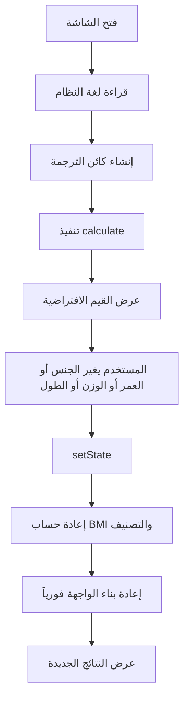

<div dir="rtl" style="width: min(1150px, 100%); margin: 0 auto; padding: 0 16px; box-sizing: border-box;">

# 🖥️ دليل تفصيلي لشاشة الحاسبة `calculator_screen.dart`

هذا الملف يشرح **بالتفصيل** كيف تم بناء شاشة الحاسبة داخل التطبيق، وكيف تتوزع الأجزاء داخل الواجهة، وما هي الـ Widgets المستخدمة، وكيف تتصل الواجهة بمنطق الحساب، ولماذا يظهر التصميم بهذا الشكل الـ Neo-Brutalist الواضح.

---

## 📋 نظرة عامة سريعة

| العنصر            | الوصف                                                             |
| ----------------- | ----------------------------------------------------------------- |
| **اسم الشاشة**    | `CalculatorScreen`                                                |
| **نوعها**         | `StatefulWidget`                                                  |
| **الدور الأساسي** | جمع مدخلات المستخدم وعرض النتائج الصحية فورياً                    |
| **الملف**         | `lib/screens/calculator_screen.dart`                              |
| **يعتمد على**     | `bmi_logic.dart` + `localization.dart` + `brutalist_widgets.dart` |
| **يدعم RTL/LTR**  | نعم، تلقائياً حسب اللغة                                           |
| **التصميم**       | Neo-Brutalist: حدود سوداء سميكة، ألوان حادة، ظل صلب، تباين مرتفع  |

---

## 🎯 الهدف من الشاشة

شاشة الحاسبة هي **القلب الفعلي للتطبيق**. المستخدم يدخل:

- الجنس
- العمر
- الوزن
- الطول
- نظام الوحدات
- اللغة

وبمجرد تغيير أي قيمة، تقوم الشاشة مباشرة بـ:

1. حساب BMI.
2. تحديد التصنيف الصحي.
3. حساب نسبة الدهون التقديرية.
4. إظهار الوزن المثالي المناسب للطول.

بالتالي الشاشة ليست مجرد واجهة عرض، بل هي **واجهة إدخال + طبقة تنسيق + نقطة ربط مباشرة مع منطق الحساب**.

---

## 🏛️ المعمارية العامة للشاشة

الشاشة مبنية على تقسيم واضح بين ثلاث طبقات:

### 1. طبقة الحالة State

هذه الطبقة تخزن القيم الحالية التي اختارها المستخدم، مثل:

- `age`
- `height`
- `weight`
- `isMale`
- `isCm`
- `isKg`
- `_currentLang`
- `bmi`
- `classificationKey`
- `classificationColor`

هذه المتغيرات موجودة داخل `State<CalculatorScreen>` لأنها تتغير أثناء الاستخدام.

### 2. طبقة المنطق Logic Integration

الشاشة لا تنفذ المعادلات الطبية بنفسها، بل تستدعي الدوال الجاهزة من:

- `BMICalculator.calculateBMI`
- `BMICalculator.getClassification`
- `BMICalculator.getIdealWeightRange`
- `BMICalculator.estimateFatPercentage`

هذا قرار تصميم جيد، لأنه يفصل بين:

- **الواجهة**: كيف تُعرض القيم
- **المنطق**: كيف تُحسب القيم

### 3. طبقة العرض UI

وهي المسؤولة عن:

- ترتيب العناصر
- بناء البطاقات
- إبراز العنصر المختار
- فتح الحوارات dialogs
- ترجمة النصوص
- ضبط الاتجاه RTL/LTR

---

## 🧠 لماذا الشاشة `StatefulWidget`؟

تم استخدام `StatefulWidget` لأن الشاشة تحتوي على عناصر تتغير باستمرار أثناء التفاعل، مثل:

- قيمة العمر
- قيمة الوزن
- قيمة الطول
- اختيار الجنس
- تبديل اللغة
- تبديل الوحدة
- النتائج المعروضة نفسها

لو كانت الشاشة `StatelessWidget` فلن يكون من السهل إعادة بناء الواجهة عند كل تغيير. لذلك `StatefulWidget` هنا هو الاختيار الصحيح والطبيعي.

---

## 🧾 المتغيرات داخل الشاشة

### أولاً: متغيرات إدخال المستخدم

<pre dir="ltr" style="text-align: left;"><code class="language-dart">int age = 25;
double height = 170.0;
double weight = 70.0;
bool isMale = true;</code></pre>

هذه القيم تمثل الحالة الحالية للمدخلات.

- `age`: عمر المستخدم
- `height`: الطول الداخلي دائماً بالسنتيمتر
- `weight`: الوزن الداخلي دائماً بالكيلوجرام
- `isMale`: الجنس المختار

> **مهم:** حتى لو عرضت الشاشة الوزن بالرطل أو الطول بالقدم/الإنش، فإن التخزين الداخلي يظل Metric لتسهيل الحسابات.

### ثانياً: متغيرات الوحدات

<pre dir="ltr" style="text-align: left;"><code class="language-dart">bool isCm = true;
bool isKg = true;</code></pre>

هذه المتغيرات لا تغيّر البيانات الأساسية، وإنما تغيّر **طريقة العرض والإدخال** فقط.

- `isCm`: هل الطول يُعرض بالسنتيمتر أم بالقدم/الإنش؟
- `isKg`: هل الوزن يُعرض بالكيلوجرام أم بالرطل؟

### ثالثاً: متغيرات الترجمة

<pre dir="ltr" style="text-align: left;"><code class="language-dart">late String _currentLang;
late AppLocalization _loc;</code></pre>

- `_currentLang`: اللغة الحالية
- `_loc`: كائن الترجمة الذي يستدعي النصوص المناسبة

### رابعاً: متغيرات النتائج

<pre dir="ltr" style="text-align: left;"><code class="language-dart">double bmi = 0;
String classificationKey = "cat_n";
Color classificationColor = Colors.black;</code></pre>

هذه القيم هي التي تُعرض في لوحة النتائج.

---

## 🚀 ماذا يحدث عند فتح الشاشة؟

يبدأ التنفيذ من `initState()`:

<pre dir="ltr" style="text-align: left;"><code class="language-dart">@override
void initState() {
  super.initState();
  String systemLang = PlatformDispatcher.instance.locale.languageCode;
  _currentLang = AppLocalization.languages.containsKey(systemLang) ? systemLang : 'en';
  _loc = AppLocalization(_currentLang);
  _calculate();
}</code></pre>

### ما الذي يحدث هنا؟

1. يحصل التطبيق على لغة النظام من الجهاز.
2. يتأكد أن هذه اللغة مدعومة داخل التطبيق.
3. ينشئ كائن الترجمة `_loc`.
4. ينفذ `_calculate()` مرة أولى حتى لا تبدأ الشاشة بنتائج فارغة.

هذا يعني أن الشاشة تظهر للمستخدم منذ البداية بقيم محسوبة فعلاً، وليس فقط حقول انتظار.

---

## 🔄 دالة `_calculate()` ولماذا هي مهمة جداً؟

هذه الدالة هي **محور التحديث** في الشاشة.

<pre dir="ltr" style="text-align: left;"><code class="language-dart">void _calculate() {
  setState(() {
    bmi = BMICalculator.calculateBMI(height, weight);
    final result = BMICalculator.getClassification(bmi);
    classificationKey = result.key;
    classificationColor = result.color;
  });
}</code></pre>

### دورها:

- تعيد حساب BMI
- تستخرج التصنيف المناسب
- تحدد اللون المناسب للحالة الصحية
- تعيد بناء الواجهة عبر `setState`

### ملاحظة مهمة

الدالة لا تحسب الوزن المثالي ولا نسبة الدهون وتخزنها في متغيرات منفصلة، بل يتم استدعاؤهما مباشرة أثناء البناء داخل الـ UI. هذا يعني أن:

- بعض النتائج محفوظة في state
- وبعض النتائج يتم اشتقاقها لحظياً أثناء `build`

وهذا أسلوب مقبول هنا لأن العمليات الحسابية خفيفة جداً.

---

## 🌍 دعم اللغة واتجاه النص RTL / LTR

من أهم الأجزاء في التصميم هذا السطر:

<pre dir="ltr" style="text-align: left;"><code class="language-dart">return Directionality(
  textDirection: _loc.isRtl ? TextDirection.rtl : TextDirection.ltr,
  child: Scaffold(...),
);</code></pre>

### لماذا هذا مهم؟

لأنه يجعل كامل الشاشة تعمل باتجاه مناسب للغة:

- العربية ⟵ من اليمين إلى اليسار
- الإنجليزية/الفرنسية/الألمانية ⟶ من اليسار إلى اليمين

### ما الذي يتأثر؟

- ترتيب النصوص
- محاذاة العناصر
- اتجاه الواجهة بشكل عام
- سلوك الـ Rows والـ dialogs في التوزيع البصري

هذا يعني أن دعم RTL ليس مجرد ترجمة نصوص، بل **تبديل في منطق العرض نفسه**.

---

## 🧱 شجرة الواجهة Widget Tree

فيما يلي شجرة مبسطة للواجهة الرئيسية:

```text
CalculatorScreen
└── Directionality
    └── Scaffold
        ├── AppBar
        │   ├── Title (localized)
        │   └── IconButton (language menu)
        └── SingleChildScrollView
            └── Column
                ├── Row (Gender Cards)
                │   ├── Expanded -> Gender Card (Male)
                │   └── Expanded -> Gender Card (Female)
                ├── Row (Age + Weight)
                │   ├── Expanded -> Counter Card (Age)
                │   └── Expanded -> Counter Card (Weight)
                ├── BrutalistContainer (Height Section)
                │   ├── Text (label)
                │   ├── Row (value + unit switch)
                │   └── Slider
                ├── BrutalistContainer (Results Dashboard)
                │   └── Row
                │       ├── Expanded (Ideal Weight)
                │       ├── Expanded (BMI Center Panel)
                │       └── Expanded (Fat %)
                └── BrutalistContainer (Reference Table)
                    └── Column
                        ├── Classification Row 1
                        ├── Classification Row 2
                        ├── ...
                        └── Classification Row 8
```

هذه الشجرة توضّح أن الشاشة ليست مبنية من Widget واحد ضخم، بل من **أجزاء منظمة قابلة للفهم**.

---

## 🧩 شرح الـ Widgets المستخدمة ولماذا تم اختيارها

### `Directionality`

الهدف منه ضبط اتجاه كل ما بداخل الشاشة وفقاً للغة.

### `Scaffold`

الإطار الأساسي لأي شاشة Flutter تقريباً. يوفر:

- AppBar
- Body
- بنية شاشة قياسية

### `AppBar`

تم استخدامه لتوفير:

- عنوان الشاشة
- زر تغيير اللغة

التصميم هنا minimal حتى لا يطغى على محتوى الحاسبة نفسها.

### `SingleChildScrollView`

وجوده مهم لأن الشاشة تحتوي على عدة أقسام رأسية، وقد لا تتسع كلها على الشاشات الصغيرة. لذلك عند الحاجة يصبح المحتوى قابلاً للتمرير بدلاً من الانكسار أو الـ overflow.

### `Column`

هو العمود الرئيسي الذي يحمل جميع الأقسام من الأعلى إلى الأسفل.

### `Row`

تم استخدامه في المواضع التي تحتاج عناصر أفقية متجاورة مثل:

- بطاقتا الجنس
- بطاقتا العمر والوزن
- محتويات لوحة النتائج

### `Expanded`

استُخدم لتوزيع المساحة بالتساوي أو بالنسبة المطلوبة بين العناصر داخل `Row`.

مثلاً:

- في بطاقات الجنس: كل بطاقة تأخذ نصف العرض تقريباً
- في النتائج: الوسط أكبر من الجانبين لأن BMI هو القيمة الأهم بصرياً

### `Padding` و `SizedBox`

هذان العنصران مهمان جداً في تنظيم المسافات. التصميم brutalist لا يعني الفوضى؛ بل بالعكس يعتمد على **فراغات محسوبة** وحدود حادة.

### `Text`

يُستخدم بكثافة، لكن مع أسلوب موحد:

- أوزان خط قوية `FontWeight.w900`
- أحجام واضحة
- تباين مرتفع

### `IconButton`

استُخدم في شريط التطبيق لفتح اختيار اللغة.

### `GestureDetector`

هذا عنصر مهم جداً هنا، لأنه يحوّل مكونات مخصصة مثل البطاقات أو شارة الوحدة إلى عناصر قابلة للنقر دون الحاجة إلى أزرار Material التقليدية.

### `Slider`

استُخدم للطول لأنه أفضل بصرياً وعملياً من أزرار الزيادة والنقصان عندما تكون القيمة ضمن مدى كبير ومتصلة.

### `Dialog`

استُخدم لعرض:

- نافذة اختيار الوحدة
- نافذة اختيار اللغة

لكن محتوى الـ dialog نفسه مصمم أيضاً بنفس أسلوب الشاشة عبر `BrutalistContainer` حتى لا ينكسر الانسجام البصري.

---

## 🎨 نظام التصميم: لماذا الشاشة تبدو بهذا الشكل؟

هذه الشاشة تعتمد على **Neo-Brutalist Design System** الموجود في `brutalist_widgets.dart`.

### العنصر الأهم: `BrutalistContainer`

هذا الـ widget هو اللبنة الأساسية للشاشة كلها تقريباً.

فكرته أنه لا يستخدم ظل Material ناعم، بل يبني الشكل يدوياً عبر طبقتين:

1. **طبقة خلفية سوداء** منزاحة قليلاً
2. **طبقة أمامية** فيها المحتوى والحدود السوداء

النتيجة هي ظل صلب وحاد يشبه المطبوعات أو البطاقات الثقيلة.

### خصائصه التصميمية

- حدود سوداء سميكة
- ظل صلب Offset
- زوايا شبه حادة
- ألوان خلفية قوية
- إحساس يدوي وجريء

### لماذا هذا مناسب للحاسبة؟

لأن التطبيق يريد أن يظهر كأداة مباشرة، جريئة، وواضحة، وليس كواجهة ناعمة أو طبية باردة. هذا الأسلوب يجعل القيم مثل BMI والنتائج بارزة بصرياً جداً.

---

## 🟨 قسم اختيار الجنس

هذا هو أول قسم في الشاشة.

### البنية

- `Row`
- داخلها `Expanded` لكل بطاقة
- كل بطاقة مبنية عبر `_buildGenderCard()`

### ما الذي تبنيه `_buildGenderCard()`؟

<pre dir="ltr" style="text-align: left;"><code class="language-dart">Widget _buildGenderCard(String label, IconData icon, bool selected, VoidCallback onTap)</code></pre>

الـ widget الناتج يتكون من:

- `BrutalistContainer`
- `Icon`
- `Text`

### سلوك التحديد

إذا كانت البطاقة مختارة، يصبح لونها:

<pre dir="ltr" style="text-align: left;"><code class="language-dart">const Color(0xFFFFDE59)</code></pre>

وهو الأصفر الرئيسي في هوية التطبيق.

### لماذا هذا تصميم جيد؟

- الاختيار واضح فوراً
- لا يحتاج RadioButton تقليدي
- متناسق مع الأسلوب الجريء للتطبيق

---

## 🔢 قسم العمر والوزن

هذا القسم مكوّن من بطاقتين مبنيتين باستخدام `_buildCounterCard()`.

### البنية العامة للبطاقة

البطاقة تحتوي على:

1. عنوان الحقل
2. القيمة الحالية
3. شارة وحدة اختيارية
4. زري زيادة ونقصان

### الدالة المستخدمة

<pre dir="ltr" style="text-align: left;"><code class="language-dart">Widget _buildCounterCard(
  String label,
  int value,
  Function(int) onChanged,
  {String unit = "", VoidCallback? onUnitTap}
)</code></pre>

### لماذا هذه الدالة مهمة؟

لأنها تعيد استخدام نفس التصميم لحقلين مختلفين:

- العمر
- الوزن

بدلاً من كتابة نفس الـ UI مرتين.

### الفرق بين بطاقة العمر وبطاقة الوزن

- بطاقة العمر: لا تحتوي على تبديل وحدة
- بطاقة الوزن: تحتوي على `onUnitTap` وبالتالي تظهر شارة الوحدة كزر قابل للنقر

### أزرار + و -

تُبنى عبر `_buildRoundButton()`:

- `GestureDetector`
- `Container` دائري
- خلفية سوداء
- أيقونة بيضاء

هذا يعطي أزراراً قوية وواضحة وسهلة اللمس.

---

## 📏 قسم الطول

هذا القسم مختلف عن العمر والوزن لأن الطول قيمة ذات مدى كبير نسبياً، ولهذا تم استخدام `Slider`.

### مكونات القسم

- عنوان `height`
- قيمة الطول المعروضة
- زر تبديل الوحدة
- `Slider`

### طريقة العرض

إذا كانت الوحدة سنتيمتر:

<pre dir="ltr" style="text-align: left;"><code class="language-dart">height.toStringAsFixed(0)</code></pre>

أما إذا كانت الوحدة قدم/إنش:

<pre dir="ltr" style="text-align: left;"><code class="language-dart">_formatHeightInFeet(height)</code></pre>

### الدالة `_formatHeightInFeet()`

وظيفتها تحويل القيمة الداخلية من سنتيمتر إلى تمثيل بشري مفهوم مثل:

```text
5' 7"
```

### لماذا هذا القسم ناجح تصميمياً؟

- `Slider` مناسب للقيم المستمرة
- القراءة سريعة
- الوحدة قابلة للتبديل بدون التأثير على التخزين الداخلي

---

## 📊 لوحة النتائج الرئيسية

هذه أكثر منطقة مهمة بصرياً في الشاشة.

تم بناؤها بهذا الشكل:

- `BrutalistContainer`
- داخله `IntrinsicHeight`
- داخله `Row`
- ثلاثة أعمدة رئيسية

### لماذا `IntrinsicHeight`؟

لجعل جميع الأعمدة بارتفاع متساوٍ حتى تظهر الفواصل السوداء العمودية بشكل متناسق من الأعلى إلى الأسفل.

### الأعمدة الثلاثة

#### 1. عمود الوزن المثالي

يعرض أقل وزن صحي محسوب حسب الطول.

#### 2. عمود BMI

هذا العمود هو المركز البصري للبطاقة، لذلك:

- أخذ `flex: 2`
- له خلفية مختلفة `Color(0xFF5CE1E6)`
- فيه رقم BMI بحجم كبير جداً
- فيه شارة التصنيف الصحي

#### 3. عمود نسبة الدهون

يعرض النسبة التقديرية للدهون بناءً على BMI والعمر والجنس.

### لماذا العمود الأوسط أكبر؟

لأن BMI هو الناتج الرئيسي الذي جاء المستخدم لأجله. لذلك تم إعطاؤه أولوية بصرية أعلى.

### كيف يتم عرض التصنيف؟

داخل `Container` أسود صغير، والنص نفسه يأخذ اللون القادم من التصنيف:

- أخضر للطبيعي
- برتقالي/ذهبي لزيادة الوزن
- أحمر للحالات الأشد

هذا يربط البيانات بالمعنى الصحي بصرياً مباشرة.

---

## 📚 جدول التصنيفات المرجعي

بعد لوحة النتائج تأتي منطقة مرجعية ثابتة تشرح للمستخدم معنى الفئات المختلفة.

### البنية

- عنوان نصي
- `BrutalistContainer`
- داخله `Column`
- كل صف يبنى عبر `_buildClassificationRow()`

### تركيب الصف الواحد

- اسم الفئة
- النطاق الرقمي BMI
- لون الفئة
- خط سفلي فاصل بين الصفوف

### لماذا هذا الجزء مهم؟

لأن المستخدم قد يرى كلمة مثل "Overweight" أو "وزن طبيعي" دون أن يفهم كل الفئات الأخرى. الجدول يحوّل الشاشة من مجرد آلة حساب إلى أداة تعليمية أيضاً.

---

## 🪟 حوارات الاختيار Dialogs

الشاشة تحتوي على نوعين من الحوارات:

### 1. حوار اختيار الوحدة

يُستخدم في:

- الوزن
- الطول

ويُبنى عبر `_showUnitDialog()`.

### 2. حوار اختيار اللغة

ويُبنى عبر `_showLanguageDialog()`.

### لماذا الحوارات هنا جيدة؟

- لا تُخرج المستخدم من الشاشة
- تعرض الخيارات بشكل مركّز
- تحافظ على نفس هوية التصميم
- الخيار الحالي مميز بصرياً

### ما الـ Widgets المستخدمة داخلها؟

- `Dialog`
- `BrutalistContainer`
- `Column`
- `Row`
- `Icon`
- `Text`
- `BrutalistButton`

حتى الـ dialogs نفسها مصممة بنفس اللغة البصرية، وهذا مهم جداً في جودة التطبيق.

---

## 🔁 رحلة التفاعل داخل الشاشة

يمكن تلخيص سلوك الشاشة بهذا التسلسل:



---

## 🧮 كيف تتصل الواجهة بمنطق الحساب؟

الشاشة لا تحتوي على المعادلات الرياضية نفسها، بل تستدعيها من `bmi_logic.dart`.

### مثال 1: حساب BMI

<pre dir="ltr" style="text-align: left;"><code class="language-dart">bmi = BMICalculator.calculateBMI(height, weight);</code></pre>

### مثال 2: التصنيف الصحي

<pre dir="ltr" style="text-align: left;"><code class="language-dart">final result = BMICalculator.getClassification(bmi);</code></pre>

### مثال 3: الوزن المثالي

<pre dir="ltr" style="text-align: left;"><code class="language-dart">BMICalculator.getIdealWeightRange(height)</code></pre>

### مثال 4: نسبة الدهون

<pre dir="ltr" style="text-align: left;"><code class="language-dart">BMICalculator.estimateFatPercentage(bmi, age, isMale)</code></pre>

### الفائدة المعمارية

هذا الفصل يجعل الكود:

- أوضح
- أسهل للاختبار
- أسهل للصيانة
- أقل تكراراً

---

## 🌐 كيف تتم الترجمة داخل الشاشة؟

كل النصوص تقريباً تمر عبر:

<pre dir="ltr" style="text-align: left;"><code class="language-dart">_loc.translate('key')</code></pre>

مثل:

<pre dir="ltr" style="text-align: left;"><code class="language-dart">_loc.translate('title')
_loc.translate('male')
_loc.translate('female')
_loc.translate('reference')</code></pre>

### لماذا هذا مهم؟

لأنه يمنع كتابة نصوص ثابتة hardcoded داخل الواجهة، ويجعل الشاشة قابلة للتوسعة للغات أخرى بسهولة.

---

## 🧪 ملاحظات هندسية على جودة التصميم الحالي

### نقاط قوية

1. **فصل جيد بين الواجهة والمنطق**.
2. **إعادة استخدام ممتازة** عبر `_buildGenderCard` و `_buildCounterCard` و `_buildClassificationRow`.
3. **دعم RTL/LTR موجود في المكان الصحيح** حول الشاشة كلها.
4. **النتائج تتحدث فورياً** مما يعطي تجربة استخدام ممتازة.
5. **التصميم البصري متماسك** بفضل `BrutalistContainer`.

### لماذا الكود سهل الفهم؟

لأن الشاشة مرتبة من الأعلى للأسفل بحسب ما يراه المستخدم فعلياً، وهذا يجعل قراءة `build()` بديهية جداً:

- الجنس
- العمر والوزن
- الطول
- النتائج
- المرجع

أي أن ترتيب الكود يطابق ترتيب الواجهة.

---

## 🪄 كيف صُممت الشاشة بصرياً؟

يمكن تلخيص الفلسفة البصرية في أربع نقاط:

### 1. التباين العالي

- أسود مقابل أبيض
- أصفر قوي لتحديد الاختيار
- سماوي للتركيز على BMI

### 2. الحدود الواضحة

- كل بطاقة محاطة بحدود سوداء سميكة

### 3. الظلال الصلبة

- ليست ظلالاً ناعمة، بل طبقات سوداء مزاحة لتعطي إحساساً جريئاً

### 4. إبراز الأهم بصرياً

- BMI أكبر من باقي القيم
- التصنيف ملون
- الوسط أوسع من الجانبين

هذه القرارات ليست عشوائية، بل تخدم الغرض الوظيفي للشاشة.

---

## 🧭 ملخص القسم المرئي لكل جزء

| القسم           | الـ Widget الأساسي              | الهدف                        |
| --------------- | ------------------------------- | ---------------------------- |
| شريط التطبيق    | `AppBar`                        | عرض العنوان وفتح تغيير اللغة |
| الجنس           | `Row` + `BrutalistContainer`    | اختيار الذكر أو الأنثى       |
| العمر           | `BrutalistContainer`            | زيادة/تقليل العمر            |
| الوزن           | `BrutalistContainer`            | إدخال الوزن وتبديل الوحدة    |
| الطول           | `BrutalistContainer` + `Slider` | تعديل الطول بسلاسة           |
| النتائج         | `BrutalistContainer` + `Row`    | عرض القيم الصحية الأساسية    |
| التصنيف المرجعي | `BrutalistContainer` + `Column` | شرح فئات BMI                 |
| الحوارات        | `Dialog` + `BrutalistContainer` | اختيار اللغة أو الوحدة       |

---

## 🔤 Quick English Summary

`CalculatorScreen` is the main interactive screen of the app. It is implemented as a `StatefulWidget` because user inputs and displayed results change continuously. The screen is built around a vertical `Column` inside a `SingleChildScrollView`, with clear sections for gender, age, weight, height, results, and BMI reference categories.

The UI relies heavily on `BrutalistContainer`, a custom widget that creates the neo-brutalist visual language through thick borders, hard shadows, and bold contrast. Input updates trigger `_calculate()`, which recomputes BMI and classification using `BMICalculator`. Localization is handled through `AppLocalization`, and the whole screen is wrapped in `Directionality` so Arabic uses RTL while other languages use LTR.

---

## ✅ الخلاصة النهائية

`calculator_screen.dart` ليس مجرد ملف يرسم عناصر على الشاشة، بل هو:

- منظم حول state واضحة
- متصل بمنطق حساب منفصل ونظيف
- مبني من widgets قابلة لإعادة الاستخدام
- ملتزم بهوية تصميم موحدة
- داعم للغات واتجاهات النص المختلفة
- مصمم ليعطي المستخدم نتيجة فورية ومفهومة بصرياً

ولهذا فهو يمثل نموذجاً جيداً لشاشة Flutter تجمع بين:

- **وضوح الكود**
- **جودة التجربة البصرية**
- **سهولة التفاعل**
- **الربط النظيف مع المنطق**

</div>
